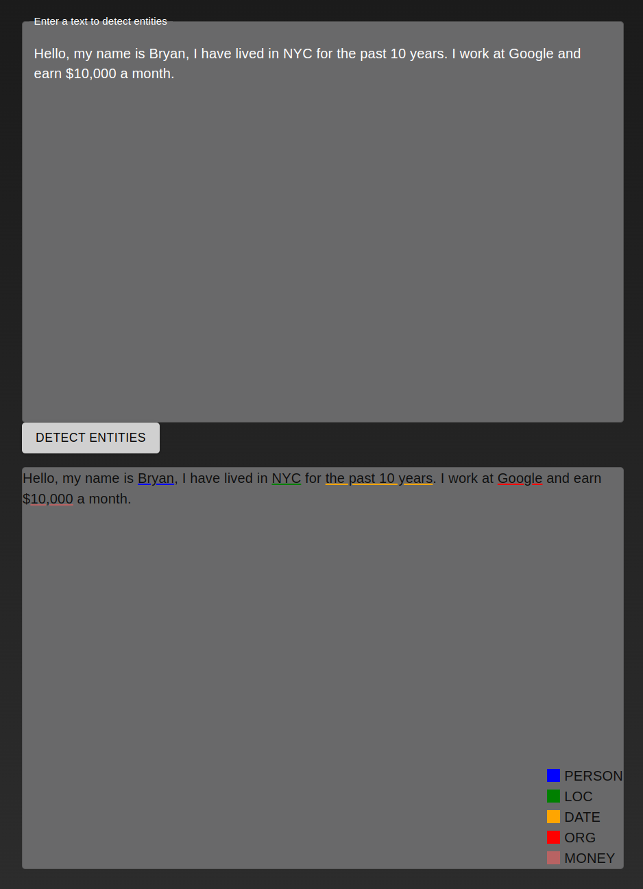

# Named Entity Recongition (NER)

A basic Named Entity Recognition project.



In order to start the projet, you must have **docker and docker-compose installed.**

Clone the projet.

## Installation (DEV)

This is the developement version that enables hot-reload.
Navigate to the repo and, in your terminal, execute the following commands:

``` bash
docker-compose build
docker-compose up -d
```

## Installation (PROD)

This is the production version.
Navigate to the repo and, in your terminal, execute the following commands:

``` bash
docker-compose -f prod.docker-compose.yml build
docker-compose -f prod.docker-compose.yml up -d
```

The app will start and be available at `http://172.17.0.1:10130/`
The swagger is available at `http://172.17.0.1:10130/api/docs`
